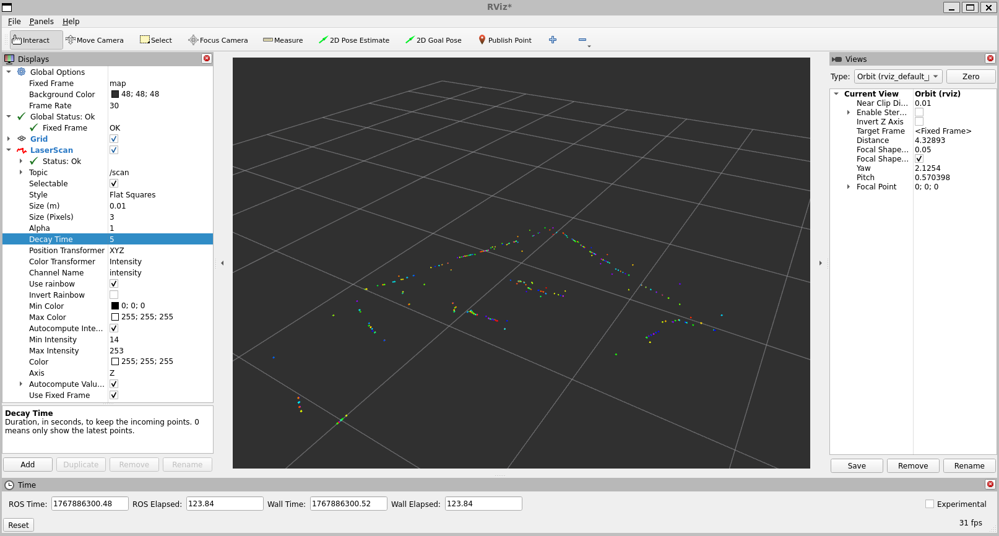
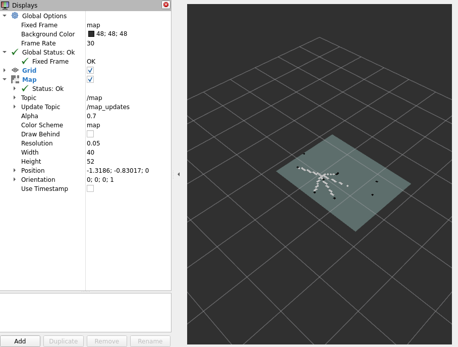

# **LDS02RR-ROS2-driver**

LDS02RR lidar ROS driver.

## Description
Tested with ROS2 Humble and Raspberry Pi Ubuntu Server 22.04.

## Hardware
Required hardware:
- LDS02RR lidar
- Lidar interface module
  - Control DC motor trough MOSFET with external power
- Linux SBC (eq. Raspberry Pi / Banana Pi)

## ROS package & node

**Package**: Lidar_ros2

**Node:** lds_lidar

## RVIZ 

